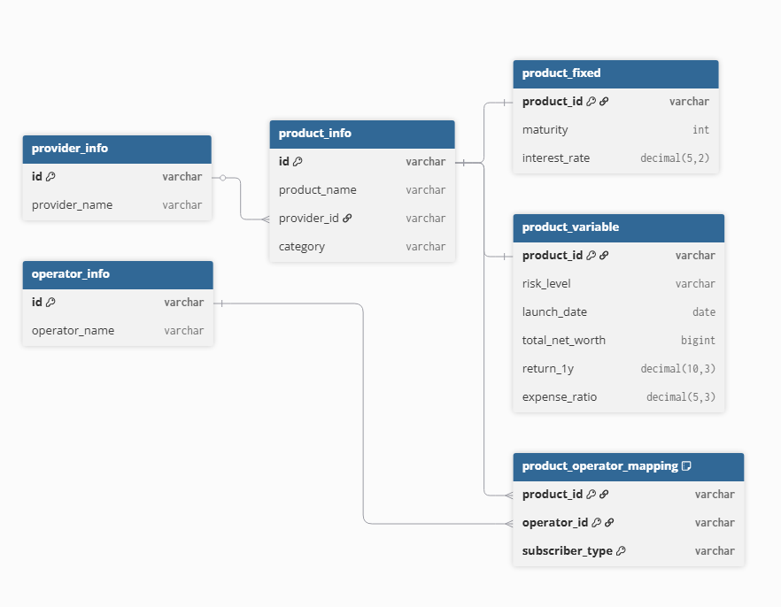
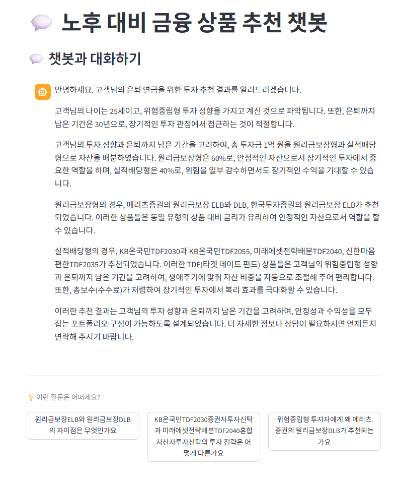

# FiChat — DC형 퇴직연금 맞춤 상품 추천 챗봇


DC형 퇴직연금 가입자를 위한 AI 기반 맞춤형 금융상품 추천 챗봇.  
투자성향 설문 → 상품 필터링 → 점수 기반 추천 → LLM 대화형 설명의 파이프라인으로 구성.

---

## 배경

DC형 퇴직연금 가입자의 대다수가 상품 정보 부족으로 원금보장 예금에만 자산을 방치하는 현실에서 출발.  
금감원 공시 데이터를 기반으로 사용자의 투자성향과 상황에 맞는 상품을 추천하고, 그 이유를 AI가 설명.

---

## 데이터 정제

### 원천데이터 문제

금융감독원 퇴직연금 비교공시 (2026년 2월 기준)

| 구분 | 상품 수 |
|---|---|
| 원리금보장 | 1,107개 |
| 원리금비보장 | 4,375개 |
| **합계** | **5,482개** |
> 출처: [금융감독원 퇴직연금 비교공시](https://www.fss.or.kr/fss/lifeplan/rtrmCmpr/list.do?menuNo=200965)

원천데이터는 상품 기본 정보·유형·사업자·매핑 정보가 단일 파일에 혼재된 구조.  
보장형·비보장형 상품의 속성(만기·이자율 vs 위험등급·수익률)이 달라 동일 기준으로 처리 불가.

### 스키마 재설계

분석 목적에 맞게 6개 테이블로 분리·설계.  
아래 다이어그램은 설계 단계 기준이며 실제 구현과 일부 상이할 수 있음.



---

## 분석 설계

### 투자성향 점수화

나이·투자 기간·손실 허용도·금융 지식 등 9개 항목 설문 응답을 점수로 변환해  
5구간(안정형·안정추구형·위험중립형·적극투자형·공격투자형)으로 분류.  
성향별로 원리금보장:비보장 자산 배분 비율을 다르게 적용.

### 추천 점수 산출

단기 수익률(1년)에만 의존하면 장기 운용 목적의 퇴직연금에 왜곡이 발생.  
이를 반영해 장기 가중 수익률 공식을 설계.

```
R = 0.2 × r₁y + 0.4 × r₃y + 0.4 × r₅y
```

은퇴까지 5년 이하인 사용자에게는 단기 수익률 가중치를 높이는 조건 분기 추가.  

비보장형 최종 점수는 수익률 외 위험등급·보수·TDF 적합도·순자산·설정기간을 함께 반영.

```
Score = 0.38R + 0.20F + 0.15C + 0.15T + 0.08A + 0.04S
(R: 수익률, F: 위험등급, C: 보수, T: TDF 적합도, A: 순자산, S: 설정기간)
```

---

## 주요 기능

- **투자성향 진단** : 9개 항목 설문 → 5구간 성향 분류
- **사업자명 유사도 검색** : 정확한 명칭 없이도 유사도 기반 후보 목록 제시 (difflib)
- **맞춤 상품 추천** : 원리금보장·비보장 상품 각각 상위 3개 추천
- **AI 설명** : 추천 상품과 자산 배분 근거를 LLM이 자연어로 설명, 후속 질의응답 지원

### 사업자명 유사도 검색


### 추천 결과 및 챗봇 설명



---

## 파이프라인

```
1. 설문        투자성향 9개 항목 입력
2. 성향 분류   점수 합산 → 5구간 분류
3. 자산 배분   성향별 원리금보장 : 비보장 비율 결정
4. 상품 필터링 가입 사업자 기준 DB 조회
5. 점수 추천   보장형·비보장형 각각 상위 3개 선정
6. LLM 설명   추천 결과를 컨텍스트로 챗봇 질의응답
```

---

## 시스템 구조

```
fichat/
├── app/
│   ├── streamlit_app.py      메인 앱 진입점
│   ├── survey_UI.py          투자성향 설문 UI
│   ├── app_ui.py             챗봇 인터페이스 UI
│   ├── user_profile.py       설문 응답 → 투자성향·자산배분 비율 변환
│   ├── models.py             데이터 모델 정의
│   ├── database.py           Supabase DB 연결·쿼리
│   ├── config.py             설문 항목·단계 설정
│   ├── recommender/
│   │   ├── engine.py         DB 조회 및 상품 분류
│   │   ├── logic.py          추천 통합 래퍼 함수
│   │   ├── guaranteed.py     원리금보장 추천 로직
│   │   └── non_guaranteed.py 원리금비보장 추천 로직
│   └── chatbot/
│       ├── llm_build.py      LLM·임베딩 모델 초기화
│       ├── rag.py            벡터스토어 구축·응답 생성
│       └── prompt.py         프롬프트 템플릿
└── upload_excel.py           금감원 공시 데이터 → DB 업로드
```

---

## 기술 스택

| 구분 | 사용 기술 |
|---|---|
| Frontend | Streamlit |
| Backend | Python |
| DB | Supabase (PostgreSQL) |
| LLM | Groq API (LLaMA 3) |
| Embedding | LangChain + FAISS |
| 데이터 | 금융감독원 퇴직연금 비교공시 |
